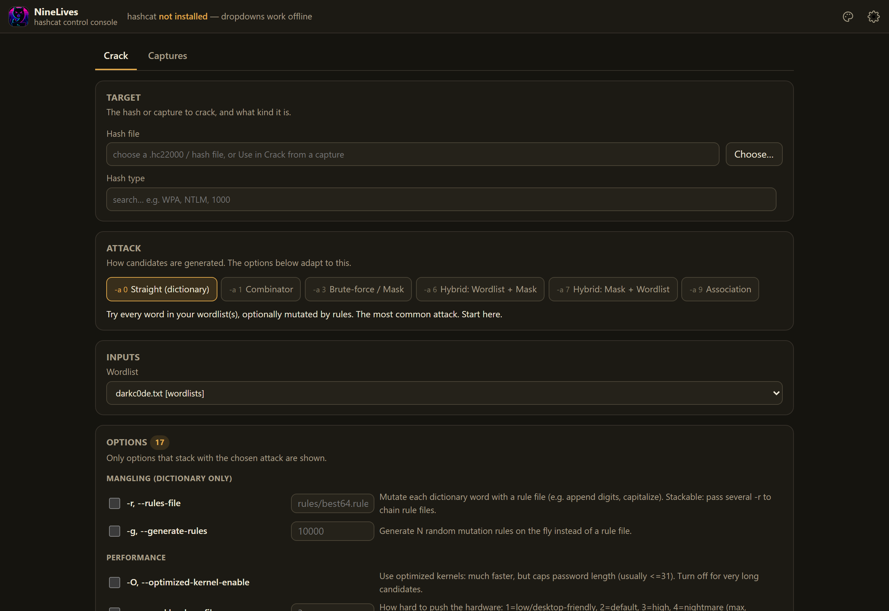
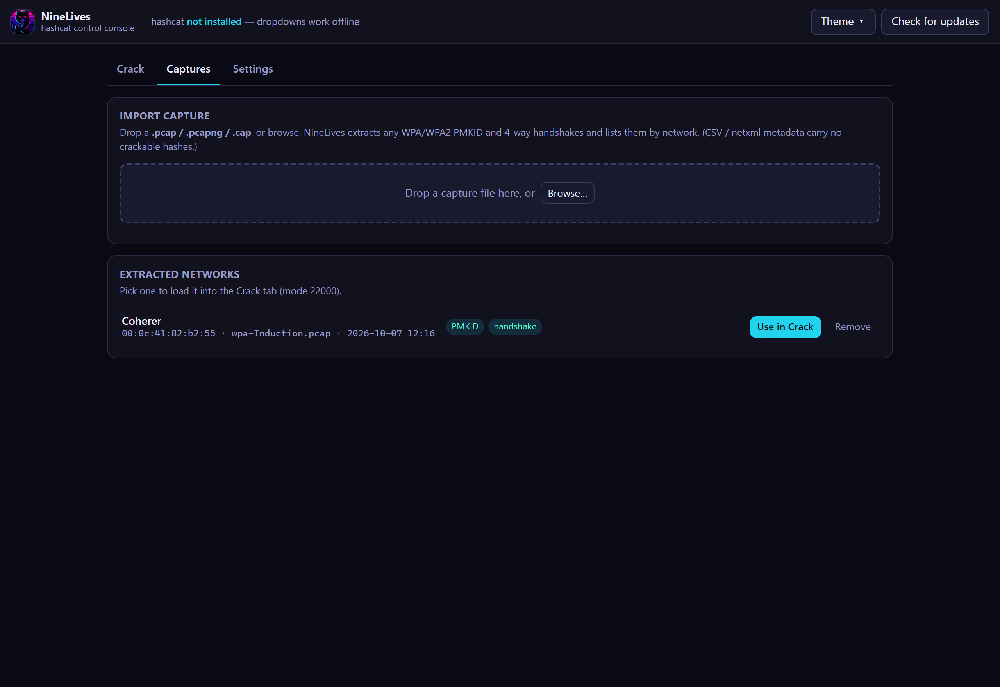
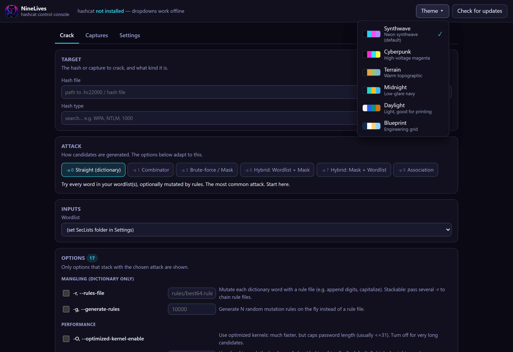
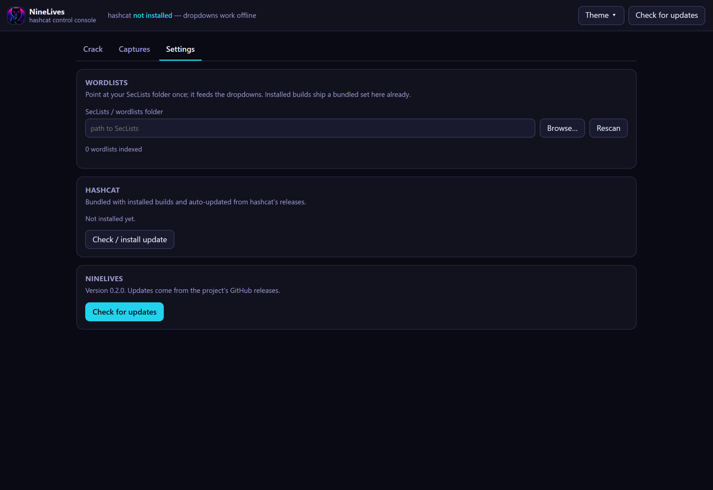

# NineLives — User Guide

NineLives is a push-button console for **hashcat**: pick a hash or capture, pick
an attack, pick a wordlist, and crack — with every option explained and only the
ones that actually combine shown. For **authorized** password auditing of
equipment you own or are explicitly scoped to test.

Screenshots are regenerated with `python docs/screenshots.py` (see
[contributing to the docs](#keeping-the-docs-current)).

> As of v1.0.0, NineLives is an **Electron** app. A fresh install ships a
> **bundled example** — a sample *Coherer* WPA capture (pre-loaded in Captures)
> and a demo wordlist — so you can crack it immediately: **Captures → Use in
> Crack → pick `wpa-demo.txt` → Run** recovers `Induction`. The workflow below
> (Crack, Captures, Themes, Settings) is unchanged. See
> [`electron/README.md`](../electron/README.md) for the app internals.

## Install

Grab the latest build from the [Releases page](https://github.com/ardyn-systems/NineLives/releases):

- **Windows:** `NineLives-Setup-<ver>.exe` (installer) or
  `NineLives-<ver>-windows-x64-portable.zip` (no install — unzip and run).
- **Linux:** `NineLives-<ver>-x86_64.AppImage` (mark executable and run; needs
  `webkit2gtk` present) or the `-linux-x86_64.tar.gz`.

Each build **bundles hashcat and a small wordlist starter set**, so it cracks out
of the box; grab bigger lists (rockyou etc.) from Settings (the cog) when you want
them. Verify downloads against `SHA256SUMS-<os>.txt`.

New to NineLives? The **? (Guide)** button in the top bar opens an in-app
walkthrough — the same one that pops up the first time you launch — and its
**Try the demo** button jumps you straight to the bundled Coherer capture.

## The Crack tab



1. **Target** — set the **Hash file** and the **Hash type**. For WPA, import a
   capture on the **Captures** tab and click **Use in Crack** to fill this in
   automatically; for other hashes, **Choose…** a hash file (it's copied into
   your data folder). The hash type is organized so you don't scroll 500+ modes:
   pick a **category** (starting with **★ Common**), then the **mode** from the
   second dropdown — or ignore both and **search** by name or number (`WPA`,
   `NTLM`, `1000`). The full list comes from hashcat itself.
2. **Attack** — pick how candidates are generated. The panels below **adapt to
   this choice**: dictionary shows rule options, mask modes show charsets, and so
   on — so you never guess which flags combine.
3. **Inputs** — pick a wordlist (or type a mask). Wordlists come from your
   SecLists folder, with ★ suggestions for the chosen hash type shown first.
4. **Options** — only the options that stack with the chosen attack, grouped into
   collapsible sections with **plain-language labels**. Flip a **toggle** to turn
   one on; options with set choices (workload, device type, output format) are
   **dropdowns**, and picking a value flips the toggle on for you — so there's
   almost nothing to type. The raw hashcat flag is shown in small type under each
   label for reference.
5. **Run crack** — a plain-language **status bar** shows what's happening
   (preparing, cracking with a progress bar, speed, estimate, and recovered
   count), ending in **Cracked! 🎉** or **Finished — not found**. The raw hashcat
   output is tucked behind **Show console**; **Show command** previews the exact
   command; **Show recovered** lists cracked results.

## Captures — turn a packet capture into hashes



Drop a **`.pcap` / `.pcapng` / `.cap`** (or **Browse**). NineLives extracts any
WPA/WPA2 **PMKID** and **4-way handshakes**, groups them by network (ESSID +
BSSID), and lists them with **PMKID / handshake** badges. Click **Use in Crack**
to load a network straight into the Crack tab as mode `22000`.

(CSV / Kismet netxml are survey metadata and carry no crackable hashes.)

## Themes



Six themes from the **Theme** menu — **Synthwave** (default) and **Cyberpunk**
neon, plus Terrain, Midnight, Daylight, and Blueprint. Your choice is remembered.

## Settings

Open Settings from the **cog (⚙)** in the top bar — it opens as a dialog.



- **Wordlists** — installed builds ship a small **starter set**. Use **Download**
  next to a list (rockyou, xato-10M, darkc0de) to fetch the bigger lists from the
  SecLists project; they land in your data dir and appear in the dropdowns
  automatically. Or point the folder box at your own SecLists checkout — all
  three sources feed the dropdowns. (Downloads run in the desktop app, not the
  hosted demo.)
- **hashcat** — check for and install hashcat updates.
- **NineLives** — shows the version and checks the project's GitHub releases for
  app updates.

## Hosted mode

NineLives can also run as a web server for an **explore + extract** deployment
(import a capture, download the `.hc22000`) — cracking stays in the desktop app.
See [hosting.md](hosting.md).

## Troubleshooting

If NineLives won't start or hangs, open the startup log — its last line shows
where it stopped:

- **Windows:** `%LOCALAPPDATA%\NineLives\startup.log`
- **Linux:** `~/.local/share/NineLives/startup.log`

A healthy launch starts the local server (`desktop: serving http://127.0.0.1:…`),
shows the window (`window shown (WebView2 ready)`, `page loaded`), and boots the
page (`js: boot: done`). If the window line never arrives and a `WARN window not
shown after 25s` line follows, the embedded browser (WebView2) stalled — NineLives
then **falls back to opening in your default browser**, so it still runs. The
companion `pywebview.log` records the browser's own startup steps. A first launch
right after installing can be slow while the OS finishes indexing the new files;
if it still won't open on later launches, send both logs.

(NineLives now talks to its backend over a local HTTP server instead of an
in-window bridge, so the old "stuck on Starting…" state can't happen — the page
isn't shown until the server is answering.)

That same `NineLives` folder holds your settings, potfile, extracted captures,
and the WebView2 browser data (it's kept out of the install directory so nothing
needs admin rights).

## Authorized use

Only use NineLives against hashes and captures from equipment you own or are
explicitly authorized to test.

## Keeping the docs current

Any change to the UI should update this guide and its screenshots in the **same
PR**. Regenerate the images with:

```bash
python -m pip install playwright && python -m playwright install chromium
python docs/screenshots.py
```
